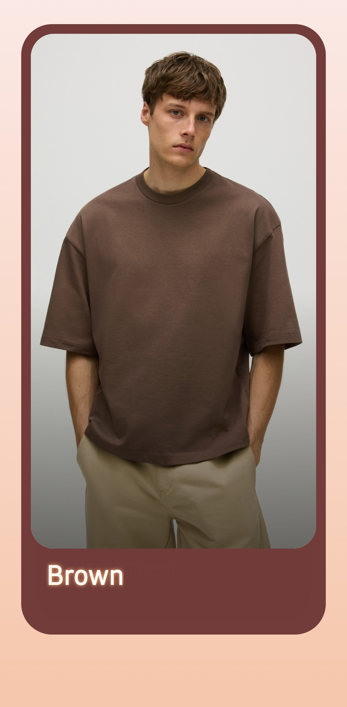
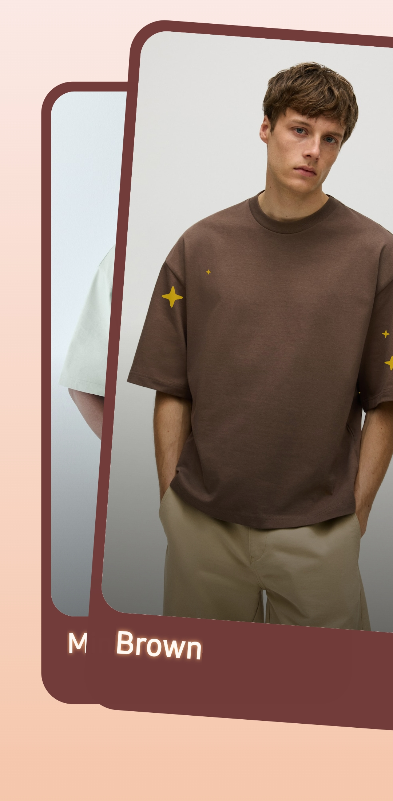
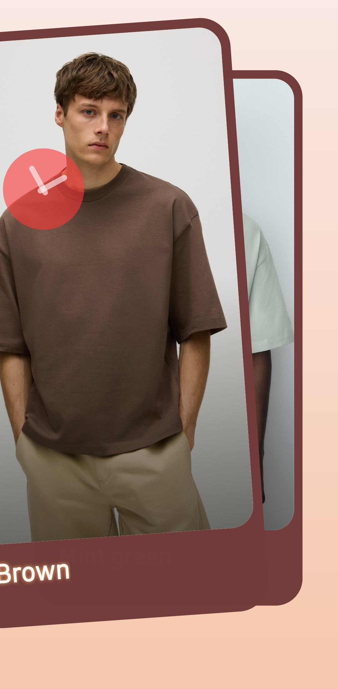
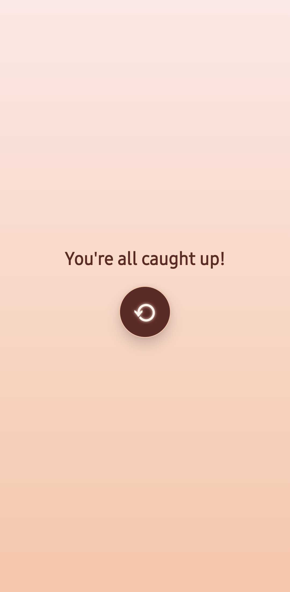

# Tinder-Style Swipeable Card App

> A smooth, swipe-based mobile app built with React Native + Expo that mimics the Tinder-style discovery feed.

This project was created as part of a Frontend Engineer internship assignment to demonstrate skills in:

-   ⚛️ React Native & Expo development
-   🎨 UI/UX design with a muted peach & maroon theme
-   🤝 Component-based architecture
-   🌀 Gesture handling with `react-native-gesture-handler` & `Reanimated`
-   ✨ Animations & Lottie integration for swipe feedback

---


## 📸 Screenshots

| Home Screen | Swipe Right | Swipe Left | Empty Deck |
| :---------: | :---------: | :--------: | :--------: |
|  |  |  |  |

---

## 🚀 Features

-   ✔️ Swipe left / right with fluid, physics-based animations.
-   ✔️ Glitter checkmark animation on right swipe.
-   ✔️ Cross animation on left swipe.
-   ✔️ Muted peach & maroon color palette for a polished look.
-   ✔️ "You're all caught up!" end state with a reload button.
-   ✔️ Responsive design across both iOS & Android.

## 🛠️ Tech Stack

-   **Expo** (React Native framework)
-   **TypeScript**
-   **React Native Gesture Handler** (For the core swipe gesture)
-   **React Native Reanimated** (For high-performance animations)
-   **Lottie React Native** (For the check/cross animations)

## 📂 Project Structure

A clean, feature-driven project structure was used to keep the code organized and scalable.

```bash
.
├── app
│   ├── (tabs)/index.tsx      # Home screen (card stack logic)
│   ├── (tabs)/_layout.tsx    # Tab navigator setup
│   └── _layout.tsx           # Root app layout
├── components
│   ├── CardItem.tsx          # UI for a single card's content
│   ├── SwipeableCard.tsx     # Swipe/gesture and animation logic
│   └── ...                   # Other shared components
├── assets/images             # Mock images for cards
├── assets/lottie             # Lottie animations (check/cross)
└── README.md
```
## 🏗️ How to Run
1. Clone the repository

```Bash
git clone https://github.com/<your-username>/tinder-swipe-app.git
cd tinder-swipe-app
```
3. Install dependencies
```Bash
npm install
```

4. Start the development server

```Bash
npx expo start
```
Once the server is running, scan the QR code with the Expo Go app on your iOS or Android device.

## 🎯 Assignment Reference
Task: Build a mobile application that displays a stack of swipeable cards (like Tinder).

- Each card shows an image + title.
- Cards can be swiped off screen left/right.
- Use a muted peach/maroon theme.
- Focus on code structure, component design, animations, and UX polish.
## 👨‍💻 Author
- Yuvraj Singh


📌 [Portfolio](https://yuvraj.bio) • [LinkedIn](https://www.linkedin.com/in/yuvraj-singh-77601827a/) • [GitHub](https://github.com/yuvraj0412s)


